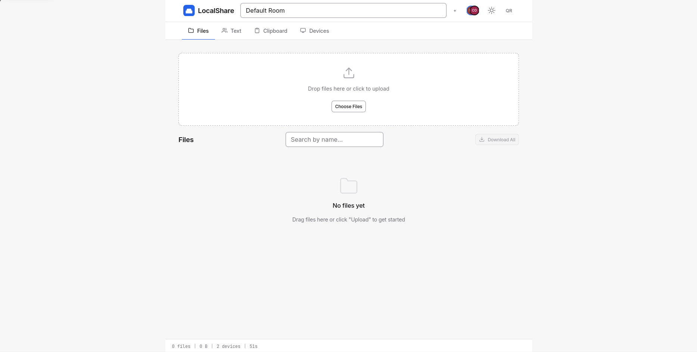
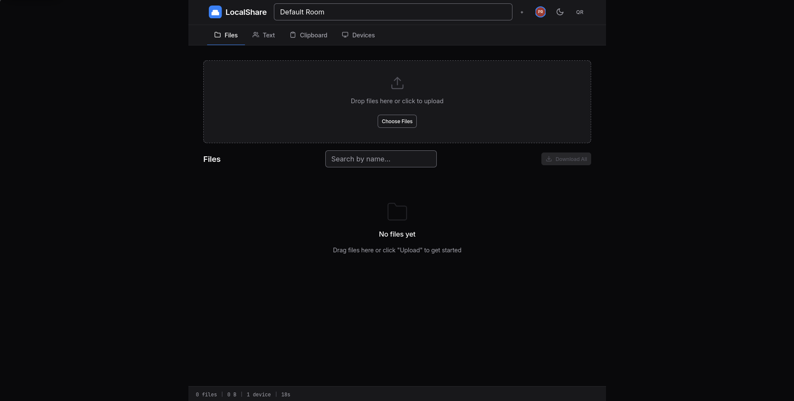

<p align="center"></p>

# LocalShare

Share files, text, and clipboard between every device on your Wi-Fi, with one command and no cloud.

[](https://www.npmjs.com/package/localshare)
[](LICENSE)
[](https://github.com/Primeeex/localshare/actions/workflows/ci.yml)
[](https://nodejs.org)

## Demo




_Screenshots are placeholders and will be replaced with real captures of the running app._

## Features

- ✨ Drag-and-drop upload for single and multiple files
- 📱 QR code to open the app on any phone
- 🔐 Optional 4 to 8 digit PIN protection with lockout
- 📋 Clipboard sync across devices
- 👥 Real-time device presence list
- 🏠 Session rooms with isolated content
- 📦 Download every file in a room as a ZIP
- 🌙 Dark mode with system theme detection
- ⌨️ Full keyboard shortcuts
- 🖼️ File preview for images, text, PDF, video, and audio
- ⏳ File expiry and automatic cleanup
- ➤ Send to a specific device (direct push)
- 📷 Upload straight from the phone camera
- ⚡ Transfer speed meter with ETA
- 📝 Notes and annotations on shared files
- 🌐 Network info panel with IP addresses, port, and QR code
- 🚀 Zero config, one command starts everything
- 🐳 Docker image and docker-compose support
- 🔄 Live updates over Server-Sent Events
- ♿ Accessible interface (WCAG 2.1 AA)
- 🔗 Copy link, rename before download, and file type icons
- 📡 Graceful shutdown with a countdown broadcast to connected clients

## Quick Start

```bash
npx localshare
```

```bash
npm install -g localshare && localshare
```

```bash
docker run --rm -p 3000:3000 -v "$PWD/uploads:/app/uploads" localshare/localshare:latest
```

Open the printed URL (or scan the terminal QR code) on any device connected to the same network.

## Installation

Requires Node.js 18 or newer and npm 9 or newer.

### npm (global)

```bash
npm install --global localshare
localshare
```

### npx (no install)

```bash
npx localshare
```

### Docker

```bash
docker build -t localshare/localshare .
docker run --rm -p 3000:3000 -v "$PWD/uploads:/app/uploads" localshare/localshare:latest
```

## Usage

Running `node bin/localshare.js --help` prints:

```text
Usage: localshare [options]

Options:
  -p, --port                Port to listen on           [number] [default: 3000]
  -d, --dir                 Upload storage directory
                                                   [string] [default: ./uploads]
  -P, --pin                 PIN for server-level auth (4-8 digits)      [string]
  -H, --host                Host to bind to          [string] [default: 0.0.0.0]
      --max-file-size       Max file size in bytes/MB/GB [string] [default: 2GB]
      --max-storage         Max total storage           [string] [default: 10GB]
      --expiry              Default file expiry (e.g. 24h, 7d, never)
                                                         [string] [default: 24h]
      --max-rooms           Maximum number of rooms       [number] [default: 20]
      --max-connections     Maximum SSE connections      [number] [default: 500]
      --max-files-per-room  Maximum files per room       [number] [default: 200]
      --no-cleanup          Disable automatic file cleanup             [boolean]
      --no-qr               Don't print QR code to terminal            [boolean]
      --no-color            Disable terminal colors                    [boolean]
      --log-level           Log level (trace,debug,info,warn,error,silent)
                                                        [string] [default: info]
      --log-format          Log format (pretty, json) [string] [default: pretty]
      --config              Path to config file                         [string]
      --version             Show version                               [boolean]
  -h, --help                Show help                                  [boolean]

Examples:
  localshare                              Start on default port 3000
  localshare -p 8080                      Start on port 8080
  localshare --pin 1234                   Require PIN 1234 to access
  localshare --expiry never --no-cleanup  Keep files forever
  localshare --max-file-size 500MB        Limit uploads to 500 MB
  localshare --dir /tmp/share             Store uploads in /tmp/share
```

Typical invocations:

```bash
localshare                          # port 3000, no PIN
localshare --pin 1234               # require PIN 1234
localshare --port 8080 --dir /data  # custom port and upload directory
localshare --expiry never           # keep files forever
```

## Configuration

Every option can be set from the command line, from an environment variable, or from a config file.

| Option            | CLI flag                  | Type    | Default     | Description                                                                                             |
| ----------------- | ------------------------- | ------- | ----------- | ------------------------------------------------------------------------------------------------------- |
| `port`            | `-p, --port`              | number  | `3000`      | Port to listen on (1 to 65535).                                                                         |
| `dir`             | `-d, --dir`               | string  | `./uploads` | Directory where uploaded files are stored.                                                              |
| `pin`             | `-P, --pin`               | string  | none        | 4 to 8 digit PIN required to open the web UI.                                                           |
| `host`            | `-H, --host`              | string  | `0.0.0.0`   | Bind address for the HTTP server.                                                                       |
| `maxFileSize`     | `--max-file-size`         | string  | `2GB`       | Maximum size of one uploaded file (`KB`, `MB`, `GB`, `TB`, or raw bytes).                               |
| `maxStorage`      | `--max-storage`           | string  | `10GB`      | Maximum total storage across all rooms.                                                                 |
| `expiry`          | `--expiry`                | string  | `24h`       | Lifetime applied to new files before cleanup, or `never`.                                               |
| `maxRooms`        | `--max-rooms`             | number  | `20`        | Maximum number of rooms (1 to 100).                                                                     |
| `maxConnections`  | `--max-connections`       | number  | `500`       | Maximum simultaneous SSE connections (10 to 5000).                                                      |
| `maxFilesPerRoom` | `--max-files-per-room`    | number  | `200`       | Maximum files allowed in one room (1 to 10000).                                                         |
| `cleanup`         | `--no-cleanup` to disable | boolean | `true`      | Run the expiry sweep every 60 seconds.                                                                  |
| `qr`              | `--no-qr` to disable      | boolean | `true`      | Print a QR code in the startup banner.                                                                  |
| `colorize`        | `--no-color` to disable   | boolean | `true`      | Colorize the pretty log output.                                                                         |
| `logLevel`        | `--log-level`             | string  | `info`      | One of `trace`, `debug`, `info`, `warn`, `error`, `fatal`, `silent`.                                    |
| `logFormat`       | `--log-format`            | string  | `pretty`    | `pretty` for humans or `json` for machines.                                                             |
| `config`          | `--config`                | string  | none        | Explicit path to a config file, checked before every search location (see [Config File](#config-file)). |
| `version`         | `--version`               | boolean | none        | Print the version and exit.                                                                             |
| `help`            | `-h, --help`              | boolean | none        | Show help and exit.                                                                                     |

### Environment variables

| Variable                        | Equivalent option | Example         |
| ------------------------------- | ----------------- | --------------- |
| `LOCALSHARE_PORT`               | `port`            | `8080`          |
| `LOCALSHARE_HOST`               | `host`            | `0.0.0.0`       |
| `LOCALSHARE_DIR`                | `dir`             | `/data/uploads` |
| `LOCALSHARE_PIN`                | `pin`             | `1234`          |
| `LOCALSHARE_MAX_FILE_SIZE`      | `maxFileSize`     | `500MB`         |
| `LOCALSHARE_MAX_STORAGE`        | `maxStorage`      | `5GB`           |
| `LOCALSHARE_EXPIRY`             | `expiry`          | `7d` or `never` |
| `LOCALSHARE_MAX_ROOMS`          | `maxRooms`        | `5`             |
| `LOCALSHARE_MAX_CONNECTIONS`    | `maxConnections`  | `100`           |
| `LOCALSHARE_MAX_FILES_PER_ROOM` | `maxFilesPerRoom` | `250`           |
| `LOCALSHARE_CLEANUP`            | `cleanup`         | `false`         |
| `LOCALSHARE_QR`                 | `qr`              | `false`         |
| `LOCALSHARE_LOG_LEVEL`          | `logLevel`        | `debug`         |
| `LOCALSHARE_LOG_FORMAT`         | `logFormat`       | `json`          |

Size values accept `KB`, `MB`, `GB`, `TB`, or a plain byte count. Duration values accept `ms`, `s`, `m`, `h`, `d`, or `never` (and `0`, which means the same thing).

## Config File

Create `localshare.config.json` next to the command:

```json
{
  "port": 3000,
  "host": "0.0.0.0",
  "dir": "./uploads",
  "pin": null,
  "maxFileSize": "2GB",
  "maxStorage": "10GB",
  "expiry": "24h",
  "maxRooms": 20,
  "maxConnections": 500,
  "cleanup": true,
  "qr": true,
  "logLevel": "info",
  "logFormat": "pretty"
}
```

Precedence: CLI flags beat environment variables, which beat the config file, which beat the built-in defaults. The defaults printed by `--help` are reference only; they never override a value from the environment or from a config file.

The config file is located by [cosmiconfig](https://github.com/davidtheclark/cosmiconfig), first match wins:

1. The explicit path passed to `--config`
2. `localshare.config.json` in the current directory
3. `localshare.config.js` in the current directory
4. `localshare.config.cjs` or `localshare.config.mjs` in the current directory
5. `.localsharc` in the current directory
6. `package.json`, under the `"localshare"` key
7. `~/.config/localshare/localshare.config.json` as the final fallback

The search walks upward from the current directory, so a config file in a parent directory still applies.

## API

LocalShare exposes a JSON REST API for everything the web UI does, plus a Server-Sent Events stream for live updates. The full request and response reference, including every event payload and error code, lives in [docs/api.md](docs/api.md).

```bash
curl http://localhost:3000/api/server/info
```

```js
const events = new EventSource(
  "http://localhost:3000/events?roomId=default&deviceId=laptop&deviceName=Laptop"
);
events.addEventListener("file:added", (e) => console.log(JSON.parse(e.data)));
```

## Docker

The `Dockerfile` builds a `node:20-alpine` image that stores uploads in `/app/uploads`:

```bash
docker build -t localshare/localshare .
docker run --rm -p 3000:3000 -v "$PWD/uploads:/app/uploads" localshare/localshare:latest
```

`docker-compose.yml`:

```yaml
version: "3.8"
services:
  localshare:
    image: localshare/localshare:latest
    ports:
      - "3000:3000"
    volumes:
      - ./uploads:/app/uploads
    environment:
      - LOCALSHARE_PORT=3000
    restart: unless-stopped
```

```bash
docker compose up -d
```

### Running behind a reverse proxy

The live event stream at `/events` is a long-lived connection, so proxy read timeouts must be raised or the stream is cut off. Nginx should set `proxy_read_timeout 3600s` for SSE endpoints:

```nginx
location /events {
    proxy_pass http://127.0.0.1:3000;
    proxy_http_version 1.1;
    proxy_set_header Connection "";
    proxy_read_timeout 3600s;
    proxy_buffering off;
}
```

### Security model and known limits

LocalShare is designed to be reachable from other devices on your LAN, so
several of its defaults are deliberately permissive. Know these before you put
it on a network you do not control:

- **CORS is `*`.** Any page on any origin your browser can reach can call the
  API. This is required for LAN sharing — the mobile client is served from a
  different host than the API in a reverse-proxy setup. It means a malicious
  website you visit _can_ read and write rooms. Do not expose the port beyond a
  trusted local network.
- **A room PIN is a door, not a wall.** It gates the UI and the room-scoped
  routes, but the room PIN is transmitted per request and the CORS header above
  still applies. Use a room PIN whenever the room holds anything you would not
  hand to every device on the LAN.
- **PINs must be 4–8 digits.** Weak PINs are rejected at creation (HTTP 400)
  rather than silently accepted.
- **PIN guessing is rate-limited** to 10 failures per room per IP per 5 minutes.
  The limit is charged only on _failed_ guesses, so a correct PIN is never
  counted against you. Once the budget is spent the room is closed to that IP
  until the window expires, including for correct PINs — a deliberate
  fail-closed trade, because verifying a PIN costs a blocking `scrypt` and an
  unmetered endpoint is a CPU-exhaustion vector.
- **Uploads are served as attachments unless they are genuinely inert.**
  Only `text/plain` and a small allowlist of image/video/audio types render
  inline. HTML, SVG, JS and anything unrecognised download as
  `application/octet-stream` with `X-Content-Type-Options: nosniff`, so an
  uploaded file can never execute on the LocalShare origin.
- **`/events` does not create rooms.** Connecting to an unknown room answers 404. Use `POST /api/rooms` for that.

## Contributing

Contributions are welcome: fork the repository, create a branch (`feat/`, `fix/`, `docs/`, or `chore/`), run the checks below, and open a pull request. See [CONTRIBUTING.md](CONTRIBUTING.md) for the development setup, code style, and pull request expectations, and [CODE_OF_CONDUCT.md](CODE_OF_CONDUCT.md) for the community guidelines.

### Testing

```bash
npm test               # run the Vitest suite once
npm run test:coverage  # run with coverage thresholds enforced
npm run lint           # ESLint over src/, bin/, public/js/, and test/
```

Coverage targets enforced by `npm run test:coverage`: 80% statements, 80% lines, 80% functions, and 75% branches.

## License

MIT. See [LICENSE](LICENSE).
